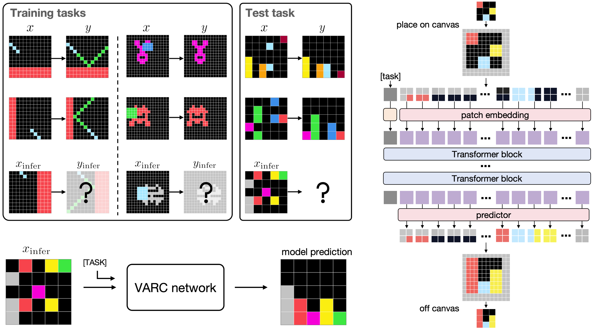
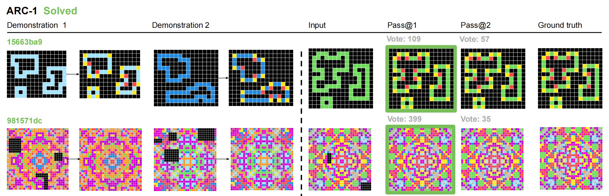
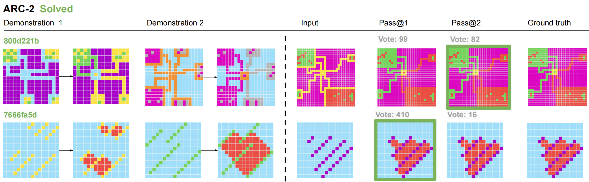
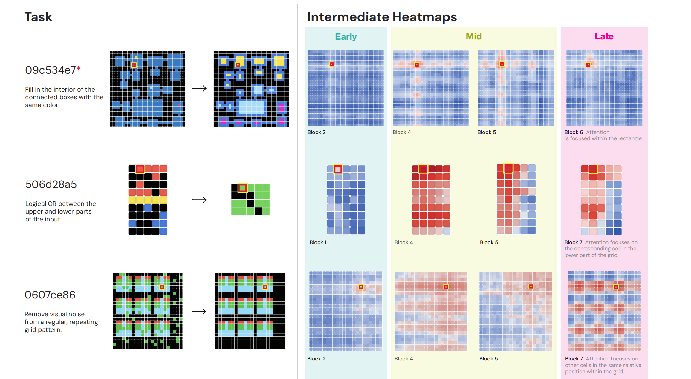
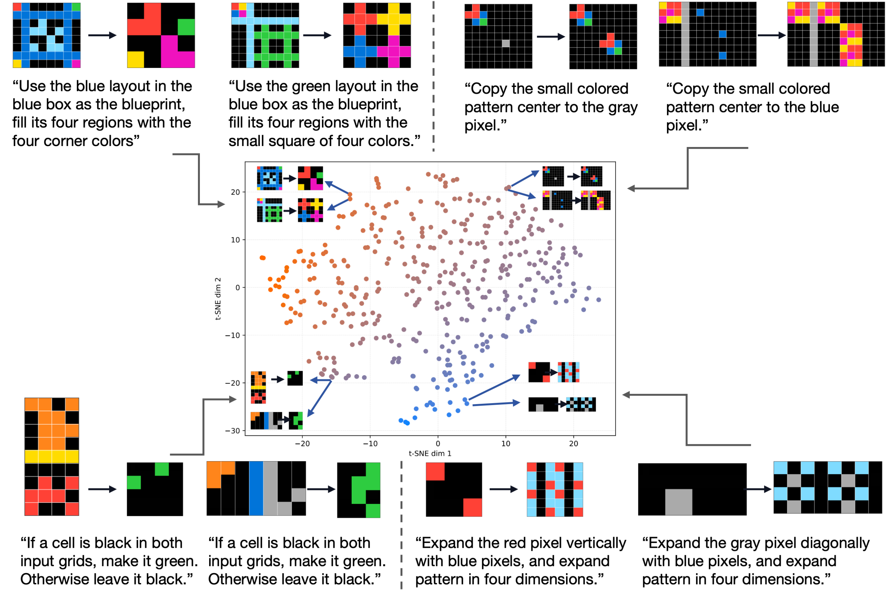
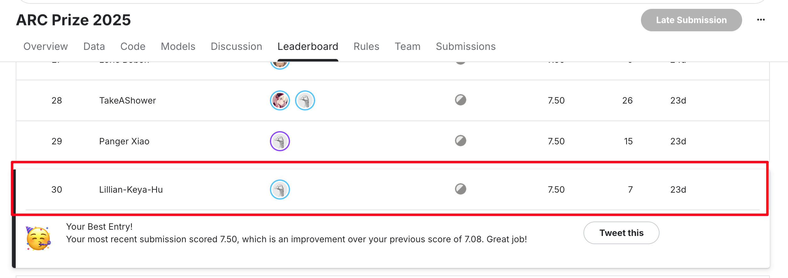
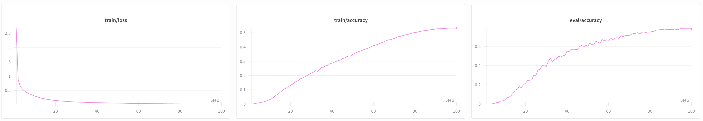
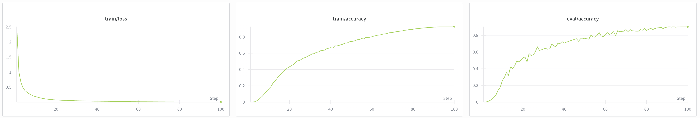

# Vision ARC



This is the project webpage for the paper [ARC Is a Vision Problem!](https://arxiv.org/abs/2511.14761)

We formulate ARC with a vision paradigm, casting it as an image-to-image translation task.

## Visualization Galleries ✨

### VARC on ARC-1 🎉
[🌟🌟Explore the full gallery on ARC-1 VARC ↗🌟🌟](https://lillian039.github.io/assets/html/varc/arc_agi_1_VARC.html)

[🌟🌟Explore the full gallery on ARC-1 VARC-ensemble ↗🌟🌟](https://lillian039.github.io/assets/html/varc/arc_agi_1_ensemble.html)



### VARC on ARC-2 🎉
[🌟🌟Explore the full gallery on ARC-2 VARC ↗🌟🌟](https://lillian039.github.io/assets/html/varc/arc_agi_2_VARC.html)

[🌟🌟Explore the full gallery on ARC-2 VARC-emsemble ↗🌟🌟](https://lillian039.github.io/assets/html/varc/arc_agi_2_ensemble.html)




### Pixel-to-Pixel Attention 🔍
Attention heatmaps highlighting how VARC aligns pixels between inputs and outputs.  
[🌟🌟Try interactive attention demos ↗🌟🌟](https://lillian039.github.io/assets/html/varc/attention_heatmap.html)



### Task Token t-SNE Demonstrations 🔍
t-SNE of task embeddings, on the 400 task tokens learned from the ARC-1 training set. Each point represents a single task.

[🌟🌟Try interactive task token demos ↗🌟🌟](https://lillian039.github.io/assets/html/varc/task_embedding_tsne.html)



# Training and Inference Code

## Environment setup
```
conda create -n visarc python==3.10
conda activate visarc
pip install -r requirements.txt
hf auth login
wandb login
```

## Download trained checkpoints & predictions

### Links to checkpoints after offline training
#### Checkpoint: VARC-ViT-18M
```
https://huggingface.co/VisionARC/offline_train_ViT/tree/main
```
#### Checkpoint: VARC-Unet-55M
```
https://huggingface.co/VisionARC/offline_train_Unet/tree/main
```

### Download checkpoints
These checkpoints are from offline training, so they still need to be evaluated with TTT.
```
mkdir saves/
mkdir saves/offline_train_ViT
mkdir saves/offline_train_Unet
hf download VisionARC/offline_train_ViT --local-dir saves/offline_train_ViT
hf download VisionARC/offline_train_Unet --local-dir saves/offline_train_Unet
```
ARC-1 and ARC-2 test-time training (TTT) use the same checkpoint from ARC-1 training dataset + [RE-ARC](https://github.com/michaelhodel/re-arc) dataset
### Download VARC's predictions
These predictions are made after TTT on each task.
```
hf download VisionARC/VARC_predictions --local-dir . --repo-type dataset
unzip VARC_predictions.zip
```

After downloading the predictions, run analysis to get results and generate HTML visualizations.

ARC-1 results:
```
bash script/analysis/arc_1_vit.sh
bash script/analysis/arc_1_ensemble.sh
```
The HTML visualizations will be at ``arc_agi_1_vit.html`` and ``arc_agi_1_ensemble.html``.

ARC-2 results:
```
bash script/analysis/arc_2_vit.sh
bash script/analysis/arc_2_ensemble.sh
```
The HTML visualizations will be at ``arc_agi_2_vit.html`` and ``arc_agi_2_ensemble.html``.

## Reproduce our result from scratch

### 1. Build augmented TTT dataset
This also includes commands to sanity check the augmented versions.
```
# Build augmented data
python augment_data.py
# Run the following command
bash script/sanity_ARC1.sh
bash script/sanity_ARC2.sh
```

### 2. Offline training
Train VARC-ViT-18M (5h 12m 42s on 8 x H200):
```
bash script/offline_train_VARC_ViT.sh 
```
Train VARC-Unet-55M (7h 21m 29s on 8 x H200):
```
bash script/offline_train_VARC_Unet.sh
```

### 3. Test-time training
#### ARC-1
Train VARC-ViT-18M with TTT:
```
bash script/test_time_training_VARC_ViT_ARC1.sh
```
Each run's result can range between [52, 56].

Train VARC-Unet-55M with TTT:
```
bash script/test_time_training_VARC_Unet_ARC1.sh
```
Each run's result can range between [47, 49].
#### ARC-2
Train VARC-ViT-18M with TTT:
```
bash script/test_time_training_VARC_ViT_ARC2.sh
```
Each run's result can range between [6, 10].

Train VARC-Unet-55M with TTT:
```
bash script/test_time_training_VARC_Unet_ARC2.sh
```
Each run's result can range between [3, 6].

### 4. Run analysis
Run analysis to get final results and generate HTML visualizations (same as with downloaded predictions) by modifying `--output-root` to the path you save your predictions (e.g., `outputs/ARC_1_eval_ViT_attempt_0`).
```
bash script/analysis/arc_1_vit.sh
bash script/analysis/arc_1_ensemble.sh
```
The HTML visualizations will be at ``arc_agi_1_vit.html`` and ``arc_agi_1_ensemble.html``.

### Important hyperparameters

#### Training hyperparmeters
| Parameter | Meaning |
|----------|-------|
| `epochs` | training epochs |
| `batch-size` | batch size |
| `learning-rate` | learning rate |
| `lr-scheduler` | default to cosine |
| `num-attempts` | how many random perspectives for per pseudo task in ttt |
| `ttt-num-each` | how many individual ttt runs per task (for ensemble)|

#### Model hyperparameters
| Parameter | Meaning |
|----------|-------|
| `architecture` | `vit` or `unet` |
| `image-size` | fix canvas size |
| `patch-size` | ViT patch size |
| `depth` | ViT transformer block num |
| `embed-dim` | ViT embedding dimension |
| `num-heads` | ViT number of attention heads |
| `unet-size`  | `big` or `medium` or `small`, only for Unet | 
| `num-colors` | 10 ARC pixel color + 1 background color + 1 border color for shape prediction |

#### Data settings
| Parameter | Meaning |
|----------|-------|
| `data-root` | `raw_data/ARC-AGI` or `raw_data/ARC-AGI-2`|
| `train-split` | path to test-time training augmented demonstration pairs for each task |
| `eval-split` | path to test-time training augmented infer inputs for each task|

#### Saving and loading
| Parameter | Meaning |
|----------|-------|
| `resume-checkpoint` | path to the offline-trained checkpoint |
| `resume-skip-task-token` | discard task token from offline training |
| `eval-save-name` | the dir to save ttt predictions under `outputs` folder |
|`save-path`| the dir to save the final offline training checkpoint |
| `best-save-path` | the dir to save the best offline training checkpoint with validation pairs |
## Other

### Verified results
Below is our verified result using VARC-ViT-18M (no ensembling) on the ARC-2 private test set from the Kaggle competition, using a slightly smaller computation setting with 4 color permutations instead of 9.

Leaderboard: https://www.kaggle.com/competitions/arc-prize-2025/leaderboard



### Offline training logs

#### Offline training curve for ViT
We use test pairs from the original ARC-1 training tasks as our validation.



#### Offline training curve for Unet


## Citation
If you find our method or models helpful, please kindly cite our paper :)
```
@misc{hu2025arcvisionproblem,
      title={{ARC} Is a Vision Problem!}, 
      author={Keya Hu and Ali Cy and Linlu Qiu and Xiaoman Delores Ding and Runqian Wang and Yeyin Eva Zhu and Jacob Andreas and Kaiming He},
      year={2025},
      eprint={2511.14761},
      archivePrefix={arXiv},
      primaryClass={cs.CV},
      url={https://arxiv.org/abs/2511.14761}, 
}
```
